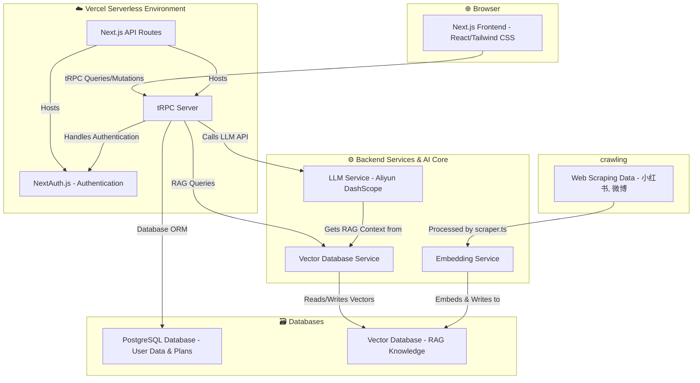

<div align="center">

# 🗺️ TravelGPT: Your AI-Powered Travel Planner

**[English](./README.md) | [简体中文](./README_zh-CN.md)**

</div>

[](https://opensource.org/licenses/MIT)

An intelligent full-stack application designed to revolutionize travel planning. Users can submit their travel ideas, and our AI assistant, powered by a Large Language Model (LLM) with a RAG-enhanced knowledge base, provides detailed feasibility analysis, reasonableness scores, and actionable suggestions to perfect the itinerary.

---

## ✨ Key Features

-   **Seamless User Authentication**: Secure sign-up and login functionality using NextAuth.js.
-   **Intuitive Plan Management**: Full CRUD (Create, Read, Update, Delete) capabilities for travel plans.
-   **AI-Powered Analysis**: One-click analysis of travel plans, providing scores and comprehensive suggestions on feasibility, budget, pacing, and more.
-   **Conversational AI Assistant**: Engage in a multi-turn dialogue with the AI to dynamically refine and optimize your travel plan.
-   **RAG-Enhanced Knowledge**: The AI assistant leverages a vector database populated with travel insights (e.g., from platforms like 小红书, 微博) to provide context-aware, highly relevant advice.
-   **Modern Tech Stack**: Built with Next.js App Router, tRPC, Prisma, and Tailwind CSS for a robust, type-safe, and visually appealing experience.

---

## 🏗️ Architecture Diagram

The application is built on a modern, decoupled architecture that ensures scalability and maintainability.



---

## 🛠️ Tech Stack

-   **Framework**: [Next.js](https://nextjs.org/) (with App Router)
-   **Backend API**: [tRPC](https://trpc.io/)
-   **Authentication**: [NextAuth.js](https://next-auth.js.org/)
-   **Database ORM**: [Prisma](https://www.prisma.io/)
-   **Database**: [PostgreSQL](https://www.postgresql.org/) (Production), [SQLite](https://www.sqlite.org/index.html) (Development)
-   **Styling**: [Tailwind CSS](https://tailwindcss.com/)
-   **LLM Service**: [Aliyun DashScope (qwen-plus)](https://www.aliyun.com/product/bailian)
-   **Vector Database**: A service like [Pinecone](https://www.pinecone.io/), [Zilliz](https://zilliz.com/), or [Supabase pgvector](https://supabase.com/docs/guides/vectors).
-   **Schema Validation**: [Zod](https://zod.dev/)
-   **Deployment**: [Vercel](https://vercel.com/)

---

## 🚀 Getting Started

Follow these instructions to set up and run the project locally.

### 1. Prerequisites

-   Node.js (v18.0 or later)
-   npm, pnpm, or yarn
-   A PostgreSQL database instance (e.g., from Vercel, Supabase, or running locally with Docker).

### 2. Installation

1.  **Clone the repository:**
    ```bash
    git clone https://github.com/ACardinals/TravelGPT.git
    cd TravelGPT
    ```

2.  **Install dependencies:**
    ```bash
    npm install
    ```

### 3. Environment Variables

1.  Create a `.env` file in the root of the project by copying the example file:
    ```bash
    cp .env.example .env
    ```

2.  Fill in the required values in the `.env` file. See the `.env.example` file for a detailed description of each variable.
    -   `DATABASE_URL`: Your PostgreSQL connection string.
    -   `DASHSCOPE_API_KEY`: Your API key for the Aliyun LLM service.
    -   `NEXTAUTH_SECRET`: A random string for session encryption (you can generate one with `openssl rand -base64 32`).
    -   `NEXTAUTH_URL`: The base URL of your application (e.g., `http://localhost:3000` for local development).
    -   *(Add keys for your chosen Vector Database service as well)*.

### 4. Database Setup

Push the Prisma schema to your database to create the necessary tables:
```bash
npx prisma db push
```
This command will also automatically generate the Prisma Client.

### 5. Running the Application

Start the development server:
```bash
npm run dev
```

Open [http://localhost:3000](http://localhost:3000) in your browser to see the application in action!

---

## 🌐 Deployment

This application is optimized for deployment on [Vercel](https://vercel.com/).

1.  **Push to Git**: Ensure your code is pushed to a GitHub repository.
2.  **Import to Vercel**: Import the repository on the Vercel dashboard.
3.  **Configure Environment Variables**: Add all the variables from your `.env` file to the Vercel project settings.
4.  **Deploy**: Vercel will automatically build and deploy the application.

For the RAG functionality to work in production, you must run your scraping and embedding scripts to populate your live vector database.

---

## 🤝 Contributing

Contributions are welcome! Please feel free to open an issue or submit a pull request.

1.  Fork the repository.
2.  Create your feature branch (`git checkout -b feature/AmazingFeature`).
3.  Commit your changes (`git commit -m 'Add some AmazingFeature'`).
4.  Push to the branch (`git push origin feature/AmazingFeature`).
5.  Open a Pull Request.

---

## 📄 License

This project is licensed under the MIT License. See the [LICENSE](LICENSE) file for details.
