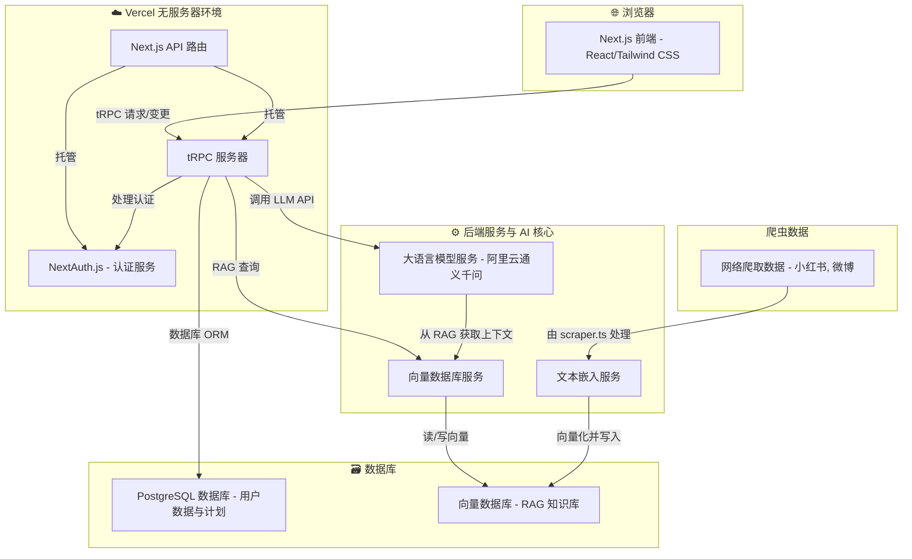

<div align="center">

# 🗺️ TravelGPT: 你的 AI 旅行规划师

**[English](./README.md) | [简体中文](./README_zh-CN.md)**

</div>

[](https://opensource.org/licenses/MIT)

一个智能化的全栈应用，旨在彻底改变旅行规划的方式。用户可以提交他们的旅行想法，我们的人工智能助手会通过一个由大型语言模型（LLM）驱动、并由 RAG 增强知识库支持的引擎，提供详细的可行性分析、合理性评分以及可执行的优化建议，从而打造完美的行程。

---

## ✨ 核心功能

-   **无缝用户认证**: 使用 NextAuth.js 实现安全的用户注册与登录功能。
-   **直观的计划管理**: 为旅行计划提供完整的增删改查（CRUD）能力。
-   **AI 驱动的智能分析**: 一键分析旅行计划，就可行性、预算、节奏等方面提供评分和全面的建议。
-   **对话式 AI 助手**: 与 AI 进行多轮对话，动态地调整和优化你的旅行计划。
-   **RAG 增强知识库**: AI 助手利用一个填充了旅行见解（例如，来自小红书、微博等平台）的向量数据库，以提供与上下文高度相关的建议。
-   **现代化的技术栈**: 使用 Next.js App Router、tRPC、Prisma 和 Tailwind CSS 构建，确保应用健壮、类型安全且界面美观。

---

## 🏗️ 系统架构图

本应用基于现代化的解耦架构构建，确保了可扩展性和可维护性。



---

## 🛠️ 技术栈

-   **框架**: [Next.js](https://nextjs.org/) (使用 App Router)
-   **后端 API**: [tRPC](https://trpc.io/)
-   **认证**: [NextAuth.js](https://next-auth.js.org/)
-   **数据库 ORM**: [Prisma](https://www.prisma.io/)
-   **数据库**: [PostgreSQL](https://www.postgresql.org/) (生产环境), [SQLite](https://www.sqlite.org/index.html) (开发环境)
-   **样式**: [Tailwind CSS](https://tailwindcss.com/)
-   **大语言模型服务**: [阿里云通义千问 (qwen-plus)](https://www.aliyun.com/product/bailian)
-   **向量数据库**: 例如 [Pinecone](https://www.pinecone.io/), [Zilliz](https://zilliz.com/), 或 [Supabase pgvector](https://supabase.com/docs/guides/vectors) 等服务。
-   **结构校验**: [Zod](https://zod.dev/)
-   **部署**: [Vercel](https://vercel.com/)

---

## 🚀 本地运行指南

请遵循以下步骤在本地设置并运行此项目。

### 1. 环境要求

-   Node.js (v18.0 或更高版本)
-   npm, pnpm, 或 yarn
-   一个 PostgreSQL 数据库实例 (例如，来自 Vercel, Supabase, 或通过 Docker 在本地运行)。

### 2. 安装

1.  **克隆仓库:**
    ```bash
    git clone https://github.com/ACardinals/TravelGPT.git
    cd TravelGPT
    ```

2.  **安装依赖:**
    ```bash
    npm install
    ```

### 3. 配置环境变量

1.  通过复制示例文件，在项目根目录创建一个 `.env` 文件：
    ```bash
    cp .env.example .env
    ```

2.  在 `.env` 文件中填入必要的值。每个变量的详细说明请参见 `.env.example` 文件。
    -   `DATABASE_URL`: 你的 PostgreSQL 数据库连接字符串。
    -   `DASHSCOPE_API_KEY`: 你的阿里云大语言模型服务 API 密钥。
    -   `NEXTAUTH_SECRET`: 用于会话加密的随机字符串 (可以通过 `openssl rand -base64 32` 生成)。
    -   `NEXTAUTH_URL`: 你的应用的基础 URL (例如，本地开发时为 `http://localhost:3000`)。
    -   *(同样需要添加你选择的向量数据库服务的相关密钥)*。

### 4. 数据库设置

将 Prisma schema 推送到你的数据库以创建所需的数据表：
```bash
npx prisma db push
```
此命令也会自动生成 Prisma Client。

### 5. 运行应用

启动开发服务器：
```bash
npm run dev
```

在浏览器中打开 [http://localhost:3000](http://localhost:3000) 查看应用！

---

## 🌐 线上部署

本应用已为在 [Vercel](https://vercel.com/) 上部署进行了优化。

1.  **推送到 Git**: 确保你的代码已推送到 GitHub 仓库。
2.  **导入到 Vercel**: 在 Vercel 控制台导入该仓库。
3.  **配置环境变量**: 将你 `.env` 文件中的所有变量添加到 Vercel 项目的设置中。
4.  **部署**: Vercel 将自动构建并部署该应用。

为了让 RAG 功能在生产环境中正常工作，你必须运行你的爬虫和向量化脚本，以填充你的线上向量数据库。

---

## 🤝 贡献代码

欢迎参与贡献！请随时提出 issue 或提交 pull request。

1.  Fork 本仓库。
2.  创建你的功能分支 (`git checkout -b feature/AmazingFeature`)。
3.  提交你的更改 (`git commit -m 'Add some AmazingFeature'`)。
4.  推送到该分支 (`git push origin feature/AmazingFeature`)。
5.  创建一个 Pull Request。

---

## 📄 开源许可证

本项目基于 MIT 许可证。详情请见 [LICENSE](LICENSE) 文件。 